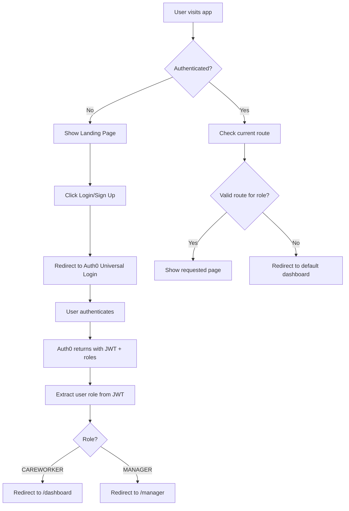

# Medical Care Worker Management System - Frontend

A modern React-based frontend application for managing care workers and managers in medical facilities, built with Auth0 authentication, real-time location tracking, and role-based access control.

## 🌐 **Live Demo**

**Frontend URL:** [https://medica-frontend.vercel.app/](https://medica-frontend.vercel.app/)  
**Backend API:** [https://medica-backend-xovg.onrender.com](https://medica-backend-xovg.onrender.com)

## 🔐 **Test Credentials**

### **Admin/Manager Account:**
- **Email:** `itsvishnups@admin.com`
- **Password:** `Vishnu@123`
- **Role:** Manager (Full access to dashboard, staff management, analytics)

### **Authentication:**
- Uses **Auth0** for secure authentication
- **Role-based access control** with automatic user role assignment
- **Google OAuth** also supported for quick signup

## 🚀 Features

### Authentication & Authorization
- **Auth0 Universal Login** - Secure authentication with email/password and Google OAuth
- **Automatic User Creation** - Users automatically created in database upon first login
- **Role-Based Access Control** - Automatic routing based on user roles
- **JWT Token Management** - Secure token handling with automatic refresh
- **Protected Routes** - Route protection based on authentication status and user roles
- **Optimized User Sync** - Efficient user synchronization with session-based caching

### User Roles & Dashboards

#### Care Worker (CAREWORKER)
- **Dashboard** - Personal shift overview and quick actions
- **GPS-Based Clock In/Out** - Location-verified time tracking with 100m radius precision
- **Real-Time Location Caching** - Pre-cached GPS coordinates for faster clock-in
- **Shift History** - View past shifts and logged hours
- **Profile Management** - Update personal information

#### Manager (MANAGER)
- **Management Dashboard** - Live overview of all facility operations with real user data
- **Active Staff Monitoring** - Real-time tracking of currently clocked-in workers
- **Comprehensive Staff List** - View all users including new signups (even without shifts)
- **Shift Logs** - Detailed shift reporting and analytics with live data
- **Location Management** - Manage facility locations and GPS settings

### Advanced Features
- **Real-Time Data Integration** - Live API integration replacing mock data
- **Coordinate Precision** - 6-decimal GPS precision for accurate distance calculations
- **Auto-Refresh Dashboards** - 30-second interval updates for real-time monitoring
- **Session Management** - Optimized user sync with session storage tracking
- **Performance Optimized** - Reduced redundant API calls and database operations

### UI/UX Features
- **Modern Design** - Beautiful gradient backgrounds and glassmorphism effects
- **Responsive Layout** - Works seamlessly on desktop, tablet, and mobile
- **Loading States** - Elegant loading animations during authentication
- **Clean Navigation** - Intuitive navigation bar with role-based menu items
- **Real-Time Updates** - Live data refreshing without page reloads
- **Smart User Display** - Shows all users including new signups, displays "No shifts" for inactive users

## 🔧 Recent Optimizations & Improvements

### Performance Enhancements
- **Single User Sync** - Users are synced with backend only once per session
- **Session Storage Tracking** - Prevents redundant API calls using `sessionStorage`
- **Optimized Clock Operations** - Streamlined clock-in/out processes
- **Reduced Database Calls** - Eliminated redundant user info updates

### Location & GPS Improvements
- **Enhanced Coordinate Precision** - 6-decimal place GPS rounding for accurate distance calculations
- **Location Caching** - Pre-cached GPS coordinates for faster clock-in/out
- **Distance Validation** - Improved Haversine formula implementation
- **Error Handling** - Better GPS error handling and user feedback

### Data Integration
- **Live API Integration** - Replaced all mock data with real backend APIs
- **Real User Statistics** - Manager dashboard shows actual user counts and statistics
- **Dynamic Staff Lists** - All users visible immediately upon signup
- **Live Shift Tracking** - Real-time shift logs and active staff monitoring

### Code Quality & Maintainability
- **TypeScript Integration** - Full type safety throughout the application
- **Optimized useEffect Hooks** - Reduced unnecessary re-renders and API calls
- **Clean Component Architecture** - Separated concerns and improved reusability
- **Enhanced Error Boundaries** - Better error handling and user feedback

## 🏗️ Architecture

### Tech Stack
- **React 18** with TypeScript for type safety
- **Vite** for fast development and building
- **Auth0 React SDK** for authentication
- **RESTful API Integration** for backend communication
- **Ant Design** for UI components
- **React Router** for client-side routing
- **dayjs** for date/time manipulation
- **Session Storage** for optimized caching

### Authentication Flow



### Role Assignment Process

1. **Auth0 Setup**
   - Roles created in Auth0 Dashboard (`caretaker`, `manager`)
   - Custom Auth0 Action adds roles to JWT tokens
   - Users assigned roles manually in Auth0 User Management

2. **Frontend Processing**
   - JWT token received from Auth0 contains role information
   - `AuthContext` extracts and maps Auth0 roles to application roles:
     - `caretaker` → `CAREWORKER`
     - `manager` → `MANAGER`
   - Role-based routing automatically directs users to appropriate dashboards

3. **Route Protection**
   - All routes require authentication
   - Role-specific routes restrict access based on user role
   - Unauthorized access redirects to appropriate dashboard

## 🚦 Getting Started

### Prerequisites
- Node.js 18+ 
- npm or yarn
- Auth0 account and application configured

### Environment Setup

Create a `.env` file in the frontend directory:

```env
VITE_AUTH0_DOMAIN=your-auth0-domain.auth0.com
VITE_AUTH0_CLIENT_ID=your-auth0-client-id
VITE_API_URL=http://localhost:4000
```

### Installation & Running

```bash
# Install dependencies
npm install

# Start development server
npm run dev

# Build for production
npm run build

# Preview production build
npm run preview
```

## 🔧 Configuration

### Auth0 Setup Required

1. **Create Auth0 Application**
   - Application Type: Single Page Application
   - Allowed Callback URLs: `http://localhost:5173`
   - Allowed Logout URLs: `http://localhost:5173`
   - Allowed Web Origins: `http://localhost:5173`

2. **Create Roles**
   - `caretaker` - For care workers
   - `manager` - For facility managers

3. **Create Auth0 Action (Post-Login)**
   ```javascript
   exports.onExecutePostLogin = async (event, api) => {
     const namespace = 'https://yourapp.com/';
     
     if (event.authorization) {
       const roles = event.authorization.roles || [];
       api.idToken.setCustomClaim(`${namespace}roles`, roles);
       api.accessToken.setCustomClaim(`${namespace}roles`, roles);
     }
   };
   ```

4. **Assign Roles to Users**
   - Navigate to User Management → Users
   - Select user and go to Roles tab
   - Assign appropriate role (`caretaker` or `manager`)

### Application Configuration

The app automatically handles:
- **Token Refresh** - Automatic JWT token renewal
- **Route Guards** - Protecting routes based on authentication and roles
- **Error Boundaries** - Graceful error handling
- **Loading States** - User feedback during async operations

## 📱 Pages & Components

### Authentication Pages
- **Landing Page** - Beautiful gradient design with login/signup call-to-action
- **Login/Signup** - Handled by Auth0 Universal Login
- **Profile** - User profile management

### Care Worker Pages
- **Dashboard** (`/dashboard`) - Personal overview and quick actions
- **Shift History** (`/history`) - Past shift records and time logs

### Manager Pages
- **Dashboard** (`/manager`) - Facility overview and management tools
- **Active Staff** (`/manager/staff`) - Real-time staff monitoring
- **Shift Logs** (`/manager/analytics`) - Comprehensive reporting
- **Location Management** (`/manager/location`) - Facility settings

### Shared Components
- **Layout** - Common navigation and layout structure
- **Loading** - Elegant loading animations
- **NavBar** - Role-based navigation menu

## 🔐 Security Features

- **JWT Token Validation** - Secure token handling and validation
- **Role-Based Access** - Route-level security based on user roles
- **CSRF Protection** - Built-in CSRF protection via Auth0
- **Secure Redirects** - Validated redirect URLs post-authentication
- **Auto Logout** - Automatic logout on token expiration

## 🚀 Deployment

### Build Commands
```bash
# Production build
npm run build

# Type checking
npm run type-check

# Linting
npm run lint
```

### Environment Variables for Production
```env
VITE_AUTH0_DOMAIN=your-production-domain.auth0.com
VITE_AUTH0_CLIENT_ID=your-production-client-id
VITE_GRAPHQL_ENDPOINT=https://your-api-domain.com/graphql
```

## 🤝 Role Management

### Adding New Users

1. **Care Worker**
   - User signs up through the application
   - Admin assigns `caretaker` role in Auth0
   - User automatically gets access to care worker dashboard

2. **Manager**
   - User signs up through the application  
   - Admin assigns `manager` role in Auth0
   - User automatically gets access to management dashboard

### Role Changes
- Role changes are immediate but require user to log out and back in
- All role assignments are managed through Auth0 Dashboard
- Frontend automatically adapts to role changes on next login

## 📝 Development Notes

- **Hot Module Replacement** - Instant updates during development
- **TypeScript** - Full type safety throughout the application
- **Modern React Patterns** - Hooks, Context API, and functional components
- **Performance Optimized** - Code splitting and lazy loading where appropriate
- **Accessibility** - WCAG compliant components and navigation

---

Built with ❤️ for modern healthcare management
